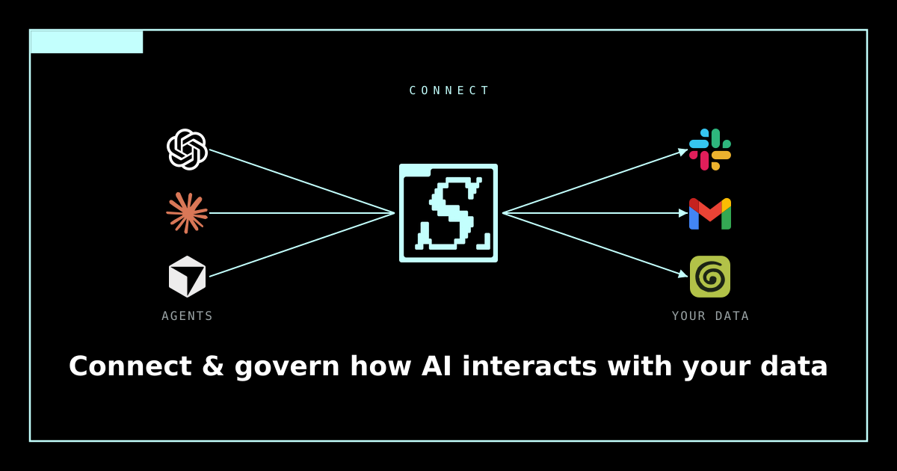

<p align="center">
  
</p>

# Sealgate MCP Server

[](https://modelcontextprotocol.io)
[](https://www.npmjs.com/package/@sealgate/mcp)
[](https://smithery.ai/servers/sealgate/gateway)
[](https://registry.modelcontextprotocol.io/v0/servers?search=sealgate)
[](LICENSE)

The Model Context Protocol (MCP) server for [Sealgate](https://sealgate.ai),
the AI data-leak-prevention platform: a security gateway and data firewall that
sits between AI agents (Claude, ChatGPT, Cursor, Copilot) and your organisation's
data and tools.

This server is a thin MCP proxy. It forwards a small set of tool calls to a
**Sealgate gateway**, which you configure with two environment variables.
Sealgate runs managed release hosts (the remote MCP gateway at `mcp.sealgate.ai`
and the Management API at `dashboard.sealgate.ai`), and demo or self-hosted orgs
run their own, so this bridge stays host-agnostic: you supply the URL and key.

## Tools

| Tool | What it does |
|------|--------------|
| `list_mcp_servers` | List the MCP servers governed by your Sealgate gateway, with access-control classification and connection status. |
| `get_session_status` | Review recent agent sessions and audit events: what agents did, which data flowed, and any blocked actions. |

## Connect to the hosted gateway

Sealgate runs a managed remote MCP gateway at `https://mcp.sealgate.ai/mcp`. It
is a per-user proxy that aggregates every MCP server you have enabled behind one
Streamable HTTP endpoint and enforces Sealgate's access-control policies on every
call. There is nothing to install: point your client at the endpoint and sign in
through the browser.

```text
Endpoint:   https://mcp.sealgate.ai/mcp
Transport:  streamable HTTP (remote, not stdio)
Auth:       OAuth 2.1 in the browser, no key to paste
```

| Client | Add it |
|:--|:--|
|  **Claude** | **[Add to Claude](https://claude.ai/new?modal=add-custom-connector&connectorName=SealGate&connectorUrl=https%3A%2F%2Fmcp.sealgate.ai%2Fmcp#settings/customize-connectors)** opens the *Add custom connector* dialog with the name and URL filled in. Claude flags it as suggested by an external link; that is expected. On Team and Enterprise plans an admin adds it. |
|  **ChatGPT** | Settings &rarr; Connectors &rarr; Advanced settings &rarr; turn on **Developer mode**. Back on Connectors, click **Create**, paste the endpoint, and name it. Start a new chat so the tools menu refreshes. |
|  **Claude Code** | `claude mcp add --transport http --scope user sealgate https://mcp.sealgate.ai/mcp`<br>Then run `/mcp` in a session to sign in. |
|  **Cursor** | [<picture><source media="(prefers-color-scheme: dark)" srcset="https://cursor.com/deeplink/mcp-install-light.svg"></picture>](https://cursor.com/en/install-mcp?name=sealgate&config=eyJ1cmwiOiJodHRwczovL21jcC5zZWFsZ2F0ZS5haS9tY3AifQ%3D%3D)<br>Not working? Add the endpoint by hand under Settings &rarr; MCP. |
|  **VS Code** | **[Add to VS Code](https://vscode.dev/redirect/mcp/install?name=sealgate&config=%7B%22type%22%3A%22http%22%2C%22url%22%3A%22https%3A%2F%2Fmcp.sealgate.ai%2Fmcp%22%7D)** requires Copilot agent mode. |
|  **Goose** | [](https://block.github.io/goose/extension?url=https%3A%2F%2Fmcp.sealgate.ai%2Fmcp&type=streamable_http&id=sealgate&name=sealgate&description=SealGate+MCP+gateway&timeout=300)<br>Adds it as an extension over streamable HTTP. |
|  **Grokbot** | Add a remote MCP server pointing at `https://mcp.sealgate.ai/mcp` over streamable HTTP, then sign in through the browser. |
|  **Any MCP client** | Add a remote server at `https://mcp.sealgate.ai/mcp` over streamable HTTP. Cline, Zed and Windsurf all work; each spells the config differently (VS Code `servers`, Cursor and Cline `mcpServers`, Zed `context_servers`, and Windsurf wants `serverUrl` where everyone else wants `url`). |

Every one-click button routes through an `https://` install URL, since GitHub
strips custom URL schemes such as `cursor://` from links.

## Connect your messaging apps

The same gateway fronts Sealgate's messaging connectors (the Beeper desktop app
plus the `sealgate-stdiod` tunnel), so any client above can read and send across
your chat networks. Every message an agent reads or sends passes through the
same policy checks and lands in the same audit log as every other tool call.

| Network | Guide |
|:--|:--|
|  **WhatsApp** | https://sealgate.ai/connect/whatsapp |
|  **Telegram** | https://sealgate.ai/connect/telegram |
|  **iMessage** | https://sealgate.ai/connect/imessage |
|  **Signal** | https://sealgate.ai/connect/signal |
|  **LinkedIn DMs** | https://sealgate.ai/connect/linkedin |
|  **Instagram** | https://sealgate.ai/connect/instagram |
|  **Messenger** | https://sealgate.ai/connect/messenger |
|  **Discord** | https://sealgate.ai/connect/discord |
|  **X** | https://sealgate.ai/connect/x |
|  **LINE** | https://sealgate.ai/connect/line |
| **Per-client guides** | [Codex + iMessage](https://sealgate.ai/connect/imessage/codex), [Claude + LinkedIn](https://sealgate.ai/connect/linkedin/claude), [ChatGPT + WhatsApp](https://sealgate.ai/connect/whatsapp/chatgpt), and all 100 at https://sealgate.ai/connect |

Codex + iMessage in one command: the companion repo
[Edison-Watch/codex-imessage](https://github.com/Edison-Watch/codex-imessage)
wires Codex to iMessage through the gateway with a single install step.

### How OAuth works

The gateway is an OAuth 2.1 authorization server, so most clients connect with no
API key at all. The flow uses dynamic client registration (RFC 7591) and client
ID metadata documents, mandatory PKCE (`S256`), and issues refresh tokens via the
`offline_access` scope, so a session stays connected without re-authenticating
every hour. Discovery, consent, and token endpoints all live on the gateway
origin, so self-hosted single-origin deployments work with no extra
configuration.

### API key in the URL

Clients that cannot run an OAuth flow can pass a Sealgate API key as a URL path
segment instead:

```
https://mcp.sealgate.ai/mcp/{api_key}/?client={label}
```

Replace `{api_key}` with the key from your dashboard and `{label}` with an
optional session label. This is not OAuth and not an `Authorization` header; the
key travels in the path.

`mcp.sealgate.ai` is the managed release host. Demo and self-hosted orgs run
their own gateway host, so substitute your own URL where needed.

## Configuration

Set two environment variables, both issued or hosted by your organisation:

| Variable | Description |
|----------|-------------|
| `SEALGATE_GATEWAY_URL` | Base URL of your Sealgate Management API (e.g. `https://dashboard.sealgate.ai`). |
| `SEALGATE_API_KEY` | Sealgate API key from your dashboard. |

If either is unset, every tool returns a clear configuration message instead of
failing, so registry probes and `--help` never crash.

## Install

Add the server to your MCP client. It runs over stdio via `npx`.
Also published in the official MCP Registry as `ai.sealgate/gateway` and
`io.github.Edison-Watch/sealgate-mcp`.

### Claude Desktop, Cursor

```json
{
    "mcpServers": {
        "sealgate": {
            "command": "npx",
            "args": ["-y", "@sealgate/mcp"],
            "env": {
                "SEALGATE_GATEWAY_URL": "https://dashboard.sealgate.ai",
                "SEALGATE_API_KEY": "your-sealgate-api-key"
            }
        }
    }
}
```

### VS Code

```json
{
    "servers": {
        "sealgate": {
            "type": "stdio",
            "command": "npx",
            "args": ["-y", "@sealgate/mcp"],
            "env": {
                "SEALGATE_GATEWAY_URL": "https://dashboard.sealgate.ai",
                "SEALGATE_API_KEY": "your-sealgate-api-key"
            }
        }
    }
}
```

Copy-paste configs also live in [`examples/`](examples/).

## Usage

```bash
# Run over stdio (default transport)
npx -y @sealgate/mcp

# Show usage
npx -y @sealgate/mcp --help
```

Set `SEALGATE_MCP_TRANSPORT=http` (with an optional `PORT`, default 3000) to
serve streamable HTTP instead of stdio.

## Develop

Requires [Bun](https://bun.sh).

```bash
bun install
bun run src/index.ts --help   # run from source
bun test                      # run tests
bun run build                 # bundle to dist/
make ci                       # lint, typecheck, dead-code, and the rest
```

## Links

- Website: https://sealgate.ai
- Docs: https://docs.sealgate.ai
- Connect guides: https://sealgate.ai/connect
- Contact: hello@sealgate.ai

## License

MIT. Copyright GPU-EVM LTD (Sealgate). See [LICENSE](LICENSE).
